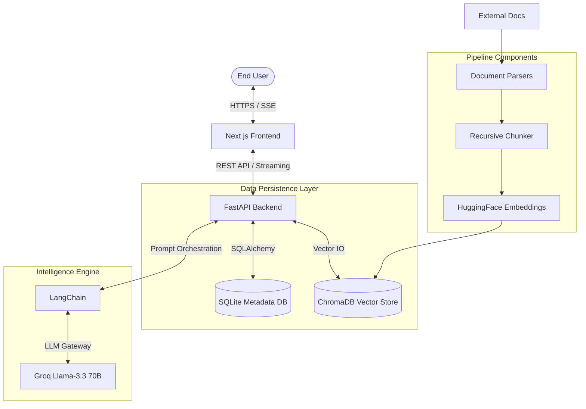

# SDLC Automation Copilot

The SDLC Automation Copilot is a specialized, enterprise-grade AI-powered Retrieval-Augmented Generation (RAG) workspace. It is purpose-built to revolutionize the creation of Software Development Lifecycle (SDLC) documentation. By leveraging large language models and vectorized knowledge bases, the platform assists Business Analysts (BAs), Functional Business Analysts (FBAs), and Quality Assurance (QA) engineers in generating high-fidelity Business Requirement Documents (BRDs), Functional Requirement Documents (FRDs), and comprehensive Test Packs from unstructured reference materials.

---

## Executive Summary

In traditional software development paths, the manual creation of requirements and test documentation is often a bottleneck, prone to human error and inconsistency. The SDLC Automation Copilot addresses these challenges by:
- **Accelerating Throughput**: Reducing the time taken to draft complex functional specifications from days to minutes.
- **Ensuring Consistency**: Maintaining a unified tone and structural integrity across different document types.
- **Role-Based Optimization**: Dynamically adjusting the technical depth and focus of generated content based on the user's professional persona.
- **Traceability**: Ensuring every generated requirement is grounded in the provided source documentation through RAG.

---

## System Architecture

The following architectural diagram illustrates the end-to-end data flow, from user interaction through the RAG pipeline to high-performance inference.



---

## Detailed Technical Stack

### Frontend Architecture (User Experience)
- **Framework**: Next.js 16 (React 19) utilizing the App Router for optimized server-side rendering and client-side transitions.
- **State Management**: React Context and specialized hooks for managing real-time asynchronous data streams.
- **Real-time Interface**: Implementation of the Fetch API with `ReadableStream` to handle token-by-token rendering, providing a seamless "typing" experience for LLM responses.
- **Styling**: Modern CSS approach with responsive design principles ensures the workspace is functional across various device contexts.

### Backend Orchestration (Process Management)
- **Core Framework**: FastAPI, chosen for its high-performance asynchronous capabilities (ASGI), which are essential for handling long-running LLM streaming requests.
- **Database Logic**: SQLAlchemy ORM for robust management of chat histories, user sessions, and metadata.
- **Concurrency**: Uvicorn server utilizing asynchronous worker classes to maximize hardware utilization.

### RAG and AI Pipeline
- **Orchestration**: LangChain provides the framework for prompt chaining, memory management, and context retrieval.
- **Vector Embeddings**: `sentence-transformers/all-MiniLM-L6-v2`. This model transforms text into high-dimensional vectors, enabling semantic search capabilities that go beyond simple keyword matching.
- **Vector Database**: ChromaDB acts as the high-speed storage and retrieval engine for document embeddings.
- **Inference Engine**: Groq Cloud utilizing Llama-3.3-70b-versatile. This provides enterprise-level reasoning with unprecedented inference speeds (tokens per second).

---

## Core Functional Modules

### 1. Intelligent Role-Based Context Injection
The platform does not simply "summarize" documents. It reimagines them through specific professional lenses:
- **Business Analyst (BA)**: Generates content focused on high-level business objectives, ROI, stakeholder requirements, and strategic alignment.
- **Functional BA (FBA)**: Produces granular technical specifications, logic flows, API definitions, and data mapping requirements.
- **Quality Assurance (QA)**: Synthesizes test strategies, positive/negative test scenarios, field validation rules, and acceptance criteria.

### 2. Context-Aware Knowledge Retrieval
Unlike standard LLM queries, every request is augmented with relevant context retrieved from the project's knowledge base. The system performs:
- **Document Ingestion**: Parsing of PDF, Docx, and CSV files.
- **Semantic Chunking**: Breaking documents into manageable units while preserving contextual meaning.
- **Similarity Search**: Retrieving the top-k most relevant text chunks to include in the LLM's prompt.

### 3. Persistent Workspace Management
The system maintains a full relational history of every interaction:
- **Session Continuity**: Multi-session support allows users to work on multiple document versions simultaneously.
- **Historical Analysis**: Users can review past generations and refine them iteratively without losing previous context.

---

## API Documentation

### Session Management
- `GET /api/chat/sessions?user_id={id}`: Returns a list of all active and archived sessions for the specified user.
- `POST /api/chat/sessions`: Creates a new workspace session. Body must include `user_id`, `role`, and `title`.
- `GET /api/chat/sessions/{id}/messages`: Retrieves the complete chronological history of a specific session.

### AI Interaction
- `POST /api/chat/query/stream`: The primary interaction endpoint. It accepts a user query and returns a Server-Sent Events (SSE) stream of tokens generated by the AI model.
- `POST /api/chat/upload`: Endpoint for document ingestion. Supports multipart/form-data for various document formats.

---

## Project Structure

```text
.
├── backend/                # FastAPI application
│   ├── app/                # Core application logic
│   │   ├── api/            # API Route definitions
│   │   ├── models/         # SQLAlchemy database models
│   │   ├── services/       # RAG, LLM, and Processing services
│   │   └── database.py     # Database configuration
│   ├── chroma_db/          # Persistent vector store
│   └── main.py             # Entry point for Backend
├── frontend/               # Next.js application
│   ├── src/                # Source code
│   │   ├── components/     # UI components
│   │   ├── app/            # Next.js App Router pages
│   │   └── utils/          # API clients and helpers
│   └── public/             # Static assets
└── uploaded_docs/          # Temporary storage for ingested documents
```

---

## Configuration and Deployment

### Environment Variables
Create a configuration file in the backend directory with the following keys:
- `GROQ_API_KEY`: Your production API key from Groq Console.
- `DATABASE_URL`: Connection string for the SQLite database.
- `CHROMA_PERSIST_DIRECTORY`: Path for vector data storage.

### Local Development Setup
1. **Prepare the Backend**:
   ```bash
   cd backend
   python -m venv .venv
   source .venv/bin/activate  # On Windows: .venv\Scripts\activate
   pip install -r requirements.txt
   python main.py
   ```

2. **Prepare the Frontend**:
   ```bash
   cd frontend
   npm install
   npm run dev
   ```

3. **Access the Application**:
   Navigate to `http://localhost:3000` in your web browser.

---

## Roadmap and Future Enhancements
- **Multi-Model Support**: Integration of Google Gemini and OpenAI GPT-4o models for comparative analysis.
- **Direct Jira Integration**: Automatically populating Jira tickets with generated acceptance criteria.
- **Advanced Document Export**: Native export to Microsoft Word and PDF with customizable templates.
- **Collaborative Editing**: Real-time collaborative workspace for multiple BAs to work on the same document.

---

## License and Attribution
This project is developed for internal SDLC automation. All rights reserved. 
For support or contributions, please contact the development team.