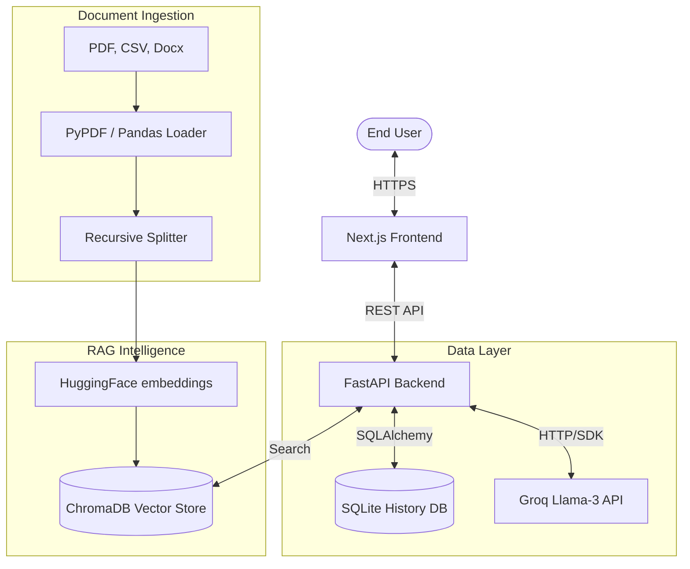

# SDLC Automation Copilot

The **SDLC Automation Copilot** is a specialized, AI-powered RAG (Retrieval-Augmented Generation) workspace designed to automate the creation of software development lifecycle documents. It assists Business Analysts (BAs), Functional BAs (FBAs), and Quality Assurance (QA) engineers in generating high-quality **BRDs**, **FRDs**, and **Test Packs** from reference documents.

---

## 🏗️ System Architecture

The following diagram illustrates the flow of data across the system components:



---

## 🛠️ Tech Stack Technical Deep-Dive

### Frontend (User Experience)
*   **Framework**: Next.js 16 (React 19) - Used for its powerful routing and efficient rendering.
*   **State Management**: React `useState` and `useEffect` hooks for handling real-time chat streams.
*   **Streaming**: Implemented using the **Fetch API** and `ReadableStreamDefaultReader` for token-by-token rendering.
*   **Icons**: **Lucide-React** for a clean, consistent set of professional icons.

### Backend (Process Orchestration)
*   **Framework**: FastAPI - Selected for its native asynchronous support, which is critical for non-blocking LLM calls and streaming.
*   **ORM**: SQLAlchemy - Manages the transition from Python objects to the relational database.
*   **Server**: Uvicorn - A lightning-fast ASGI server implementation.

### AI & RAG Pipeline
*   **Orchestration**: **LangChain** - Used to chain prompts, maintain context, and retrieve similar document chunks.
*   **Embeddings**: `sentence-transformers/all-MiniLM-L6-v2` - A high-performance local model that converts text into 384-dimensional vectors.
*   **Vector Database**: **ChromaDB** - A specialized database for high-speed similarity searches across multi-format documents.
*   **LLM Inference**: **Groq (Llama-3.3-70b-versatile)** - Provides high-context reasoning and near-instant document generation speeds.

---

## 📂 Core Features in Detail

### 1. 🧠 Role-Based Context Injection
The system uses **Prompt Engineering** to adjust the output based on the user's role.
*   **BA Role**: Focuses on high-level business goals, requirements gathering, and stakeholder impact.
*   **FBA Role**: Focuses on technical logic, API specifications, and database workflows.
*   **QA Role**: Focuses on edge cases, field validations, and step-by-step test execution logic.

### 2. 🕒 Persistent Multi-Session History
All conversations are stored in a relational database. This allows for:
*   **Resume Capability**: Switch between different document drafts without losing progress.
*   **Metadata Tracking**: Each session stores the creation date, role, and a truncated title from the first query for easy navigation in the sidebar.

### ⚡ Real-Time Streaming Implementation
Instead of the standard `JSON` response, the backend uses a generator to yield tokens as they arrive from the Groq API. The frontend `fetch` reader then decodes these chunks sequentially, updating the React state on every chunk for a typing effect.

---

## 📡 API Reference

### Authentication
*   `POST /api/auth/login`: Validates user and returns a mock-JWT, role, and user_id.

### Chat Sessions
*   `GET /api/chat/sessions?user_id={id}`: Lists all past sessions for a user.
*   `GET /api/chat/sessions/{id}/messages`: Retrieves the full conversation history for a specific session.
*   `POST /api/chat/sessions`: Initializes a new session with a title and role.

### Query Engine
*   `POST /api/chat/query`: Standard non-streaming RAG query (legacy).
*   `POST /api/chat/query/stream`: **Main Endpoint.** Returns a token stream for real-time document drafting.

---

## 🗄️ Database Schema (SQLite)

### Table: `chat_sessions`
| Column | Type | Description |
| :--- | :--- | :--- |
| `id` | UUID | Primary Key |
| `title` | String | Truncated first query for sidebar |
| `role` | String | Role context (BA, FBA, QA) |
| `user_id` | String | Reference to the user |
| `created_at` | DateTime | Session creation timestamp |

### Table: `chat_messages`
| Column | Type | Description |
| :--- | :--- | :--- |
| `id` | UUID | Primary Key |
| `session_id` | UUID | Foreign Key linking to session |
| `role` | String | Either 'user' or 'assistant' |
| `content` | Text | The actual message content |
| `created_at` | DateTime | Timestamp of the message |

---

## 🚧 Future Roadmap
- [ ] **Gemini Integration**: Support for Google's Gemini models as an alternative to Groq.
- [ ] **Jira Sync**: Automatically fetch user stories and tickets into the RAG context.
- [ ] **Export to Word/PDF**: Dedicated backend converters for professional document formatting.
- [ ] **Admin Dashboard**: Analytics on document generation accuracy and usage metrics.

---

## ⚙️ Environment Configuration

Ensure the following variables are set within `backend/app/services/rag_service.py` (or a `.env` file for production):
```bash
GROQ_API_KEY=gsk_... # Your Groq API Key
```

### Installation
1.  **Backend Setup**:
    ```bash
    cd backend
    pip install -r requirements.txt
    python main.py
    ```
2.  **Frontend Setup**:
    ```bash
    cd frontend
    npm install
    npm run dev    